# Writeup of FlareOn-12 Challenge 5 (ntfsm.exe)

Here, i will present how i solved this challenge without paid decompilers like IDA PRO and used the python capstone library for scripting instead. (I was shocked when I saw the official writeup also using capstone)
This writeup will help you solve from the perspective of a beginner. It may not be the optimal writeup but it sure was what i did.

**NB: I am only using free version of all tools mentioned here.**

### **The beginning**

So as a first step, i always run strings on the binary first. But in our case, it will not yield anything useful, but a whole bunch of floof.
Static analysis didn't reveal anything noteworthy except weird messages. So I'll move to dynamic analysis. 

When monitoring the process with ProcMon, you''ll see the following:
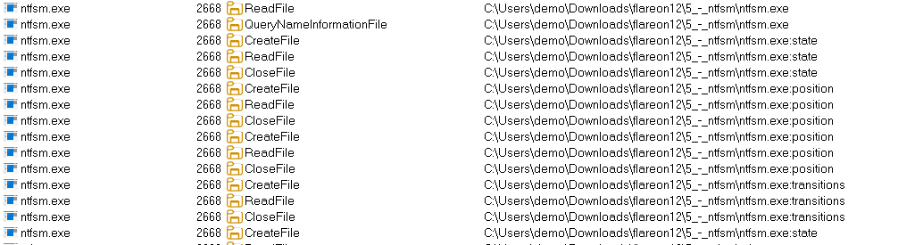

The presence of ":" is a strong confirmation that this binary is dealing with the ADS streams. Specifically the streams named, "`Position`", "`State`", "`Transitions`" and "`Input`". At this point I don't know what this does right now, but we'll proceed anyways.

Any attempts to enter a vague password leads to havoc like weird message boxes, system reboots, etc. So i proceed with the code analysis.

IDA gives up trying to display the graph view. You can change the max nodes displayed in the graph but that will hang your VM for sure. Anyways. after some time with IDA, I located the function at offset `14000c0b0` as the main function of interest. All functions calls in this binary were masked via thunk functions which makes static analysis frustrating.
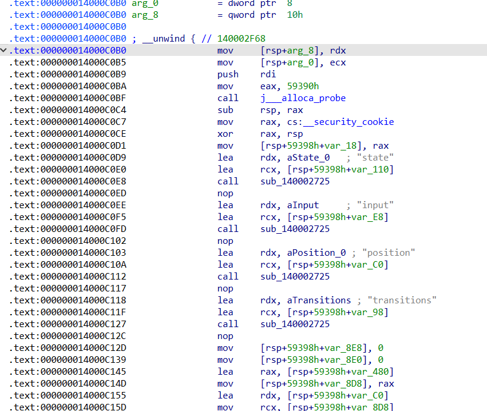
Eventually i figured out that the following two variables must both be equal to `0x10` (16) for the binary to print the flag.

BTW there is no hardcoded key in this binary so it is worthless to try to manually change the variables because the decryption of flag happens as follows

`flag = AESDecryption( cipher_text=Enc_flag, key=SHA256hash( cmdline input ) )`

You can verify the above logic by navigation to function `14000B2A0`.

While dynamically debugging the executable, step by step, for sample input, you'll eventually reach the following point:
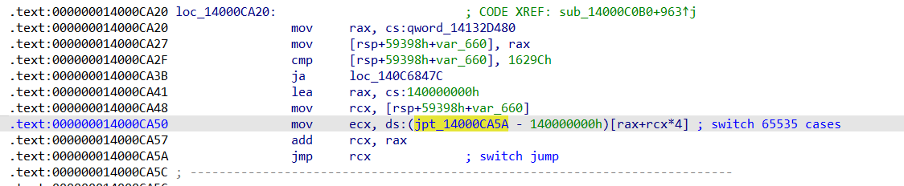
This is a very huge jumptable containing the offsets to functions corresponding to specific case numbers as determined by the `rcx` register. if you see the assignment of `var_660`, you'll see it always starts with 0 meaning `case 0`.

Lets navigate to case 0
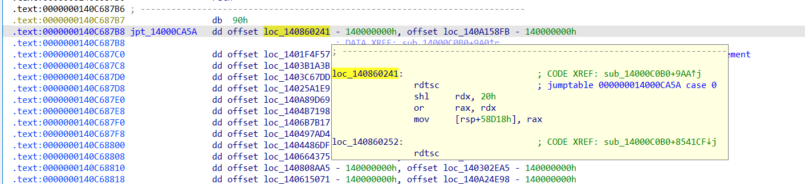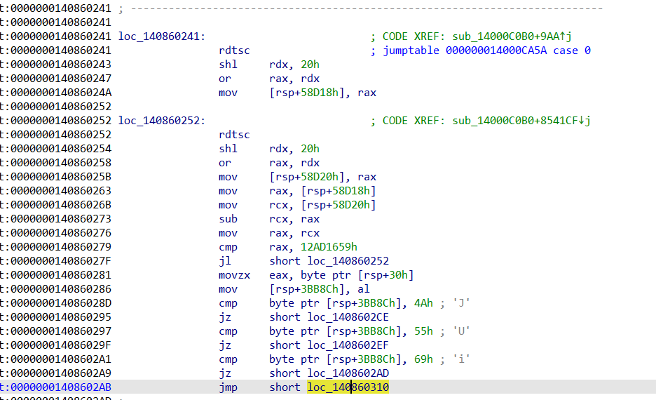
So this function, compares some value (the first character of our cmdline input, you can come to this conclusion using the debugger and checking the value of "`eax`" register). If the first character is neither "`J`", "`U`" nor "`i`", then the following very annoying function is called
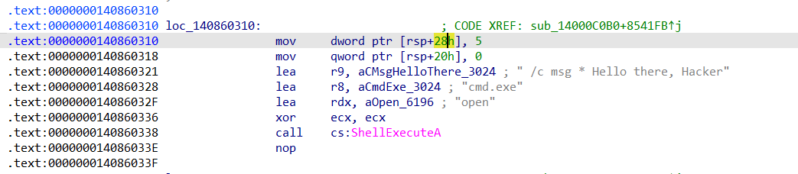
Now, we will have to use binary ninja, since IDA is failing to decompile. It does take a hell lot of time, but it makes it very user friendly.
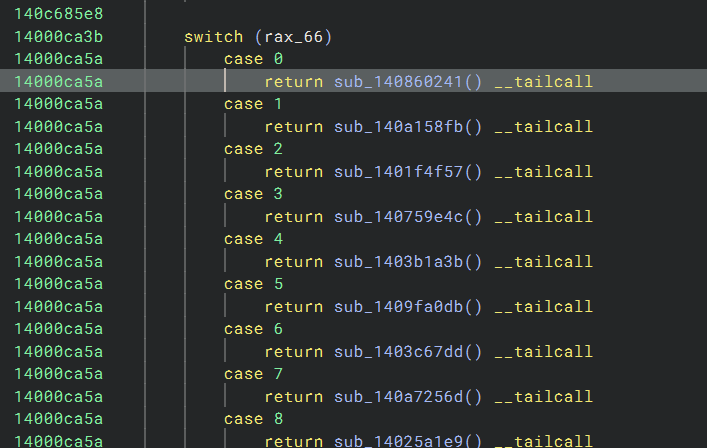
If you read a little about the `rdtsc` calls, you'll see that its a different way to add time delay instead of using sleep. The author mentions that this makes brute forcing the binary practically impossible.

The main part of the function (`case 0`) is as follows:
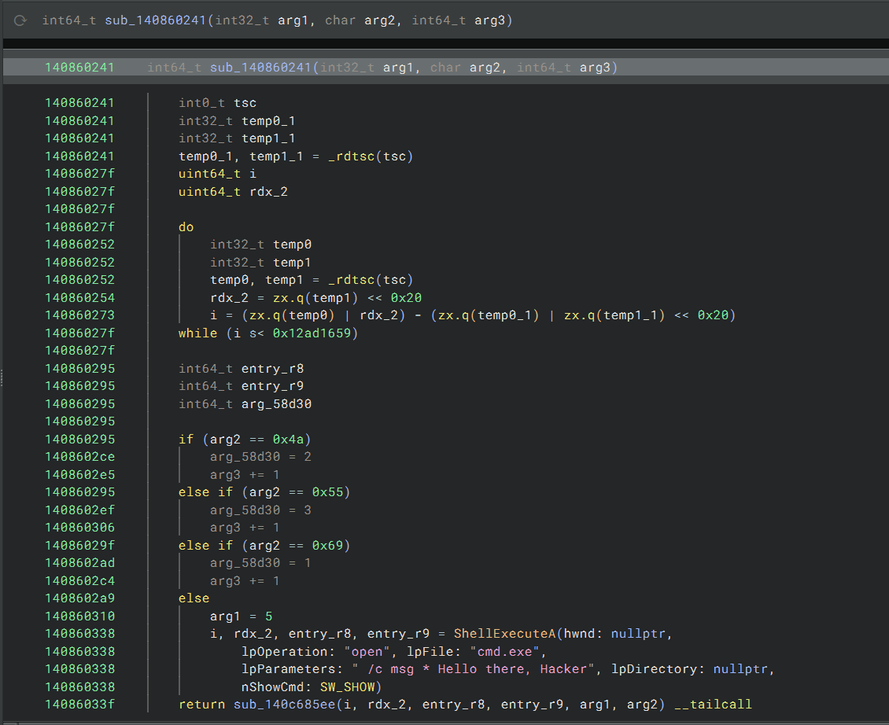
When analyzing 5-10 more such cases, you'll see a pattern. They all have a time delay at first, then a comparison following which are variable assignments. Sometimes there will only be 1 or sometimes upto 3. And at the end of each case, the function `sub_140c685ee` is called always.

Eventually, when you correlate this with debugging, you'll see that the `arg_58d3` here represents the next case number to trigger and the `arg3`, represents the pointer to the next character in out cmdline argument.

The function `sub_140c685ee`, spawns a new child process of the same binary. This is very effective to hamper debugging but can be tackled by terminating the currently debugged binary right before child creating and then running the binary again. (works for this binary but not a universal strategy).

### **Hol' up**

lets recap what we know now before going further.
1. the binary deals with the ADS streams of NTFS.
2. It starts with `case 0` and reads input character by character
3. decides the next case based on the current character as input
4. spawns a new instance of itself for each next character.
5. every time, an instance runs, the "`transitions`" ADS is incremented if a valid case is hit and the "`position`" ADS is incremented and "`state`" ADS contains the next case number to trigger and "`input`" ADS contains the cmdline argument. (This all is derived by dumping the ADS using PowerShell command:  `powershell -command "Get-Content -Path 'ntfsm.exe' -Stream 'position' -Encoding Byte | Set-Content -Path 'position_stream.bin' -Encoding Byte`")

Now our task is to figure out the states and transitions. The binary name "`ntfsm`" hints at FSM (Finite State Machines). If you read about it, according to google: "A finite state machine (FSM) is a mathematical model of computation that can be in only one of a finite number of states at any given time. It transitions from one state to another based on inputs, with each state having a set of transitions triggered by specific inputs"

### **Mapping the states**

Now the main task is how to do it. 
I started doing it manually at first. (I know it was stupid).
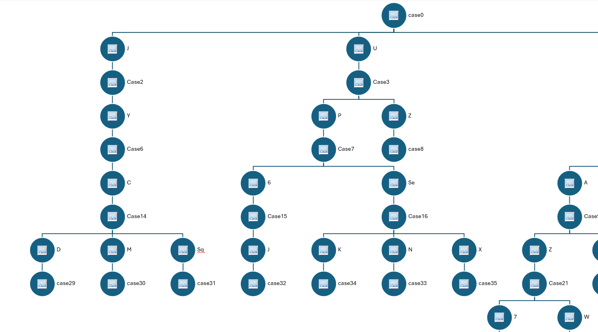

I knew i had to do some scripting but i didn't have IDA pro (hence no IDA Python). So i will be using python's capstone library.

The first thing to do is to parse the jumptable.
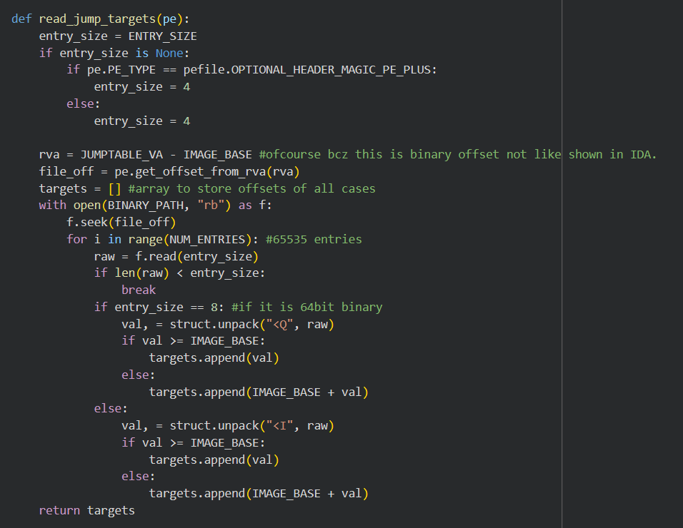
Try to understand what the code does, since it is fairly straight forward. It just parses the jumps (we gave offset to jumptable ourselves) and calulates absolute offsets.

In our main(), we can do following:
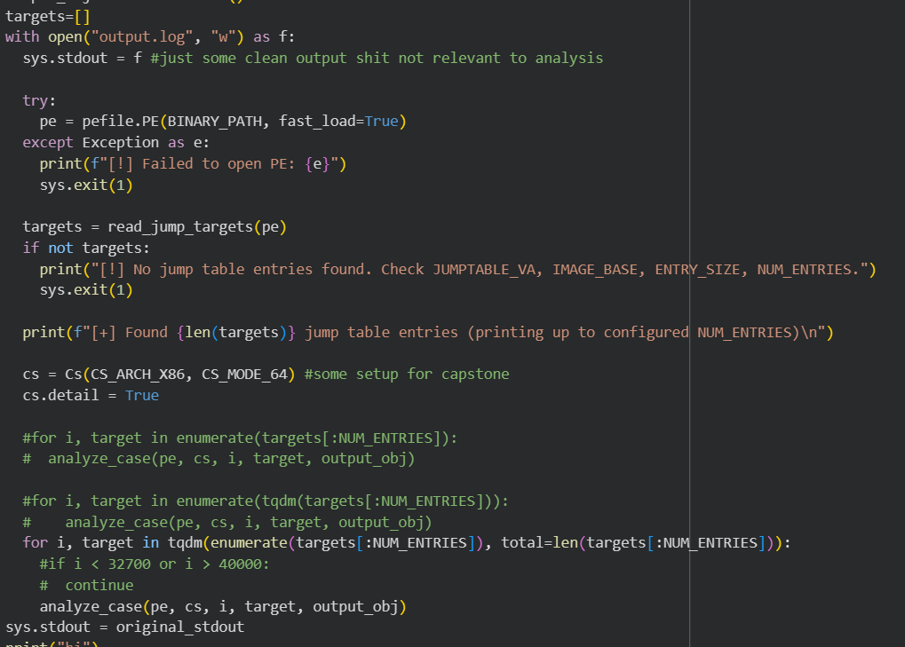

Now lets see the `analyze_case()` function.
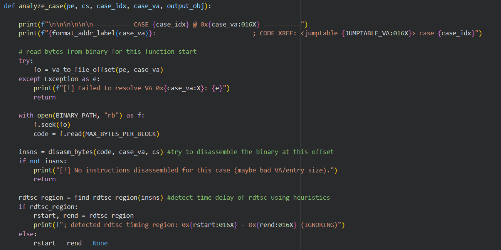

It basically tries to disassemble the function at that offset then runs a `find_rdtsc_region()` heuristic to eventually skip it.
To understand how this heuristic works, look at this:
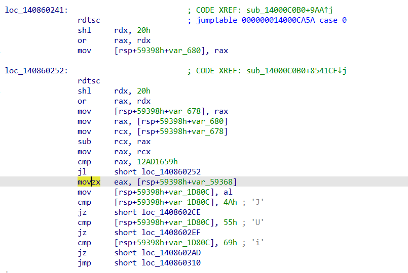
We first find the "`rdtsc`" instruction and then traverse forwards till we reach a "`movsx`", or "`movzx`" or "`cmp`" instruction. This is the region we want to skip. Refer to the code for this part, it is easy to understand once you understand how the region is being skipped.

Now see the following logic after the rdtsc delay.
We are bound to encounter some conditional jumps (can be 0 or can be upto 4) and one unconditional jump.
This means we must terminate as soon as we reach an unconditional jump. Now our main motive is to build a dataframe, that contains the current case number, its trigger and its target case.
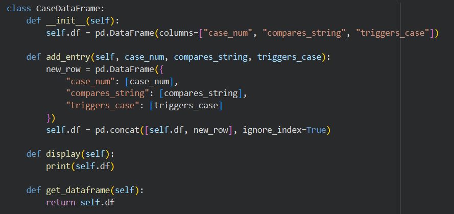
So in our analze function, we disassemble the code, find the comparision character, disassemble to code at the conditional jump, find the next case variable, and append it to the dataframe.

After around 30 minutes of run time, on google collab, we will have the dataframe ready at out hand. Now we do the mapping.

We will start with case 0, see which cases it triggers, then go to that cases and see which cases do these triiger. Just like a BFS and keep note of the cases as a list. 
Now the main part is that we will go till 15 transitions only, so that we can see the list of final cases among which one is the winning case (which btw does not trigger a next case).
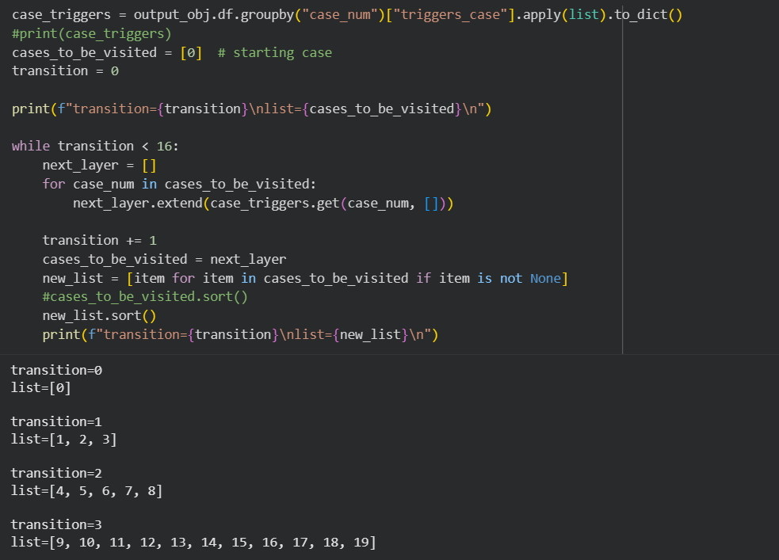
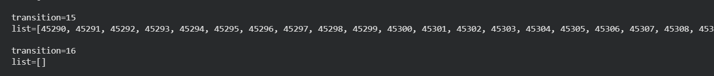

This means that exactly one of cases between `45290` and `65534` contain an increment to the "`transitions`" ADS.
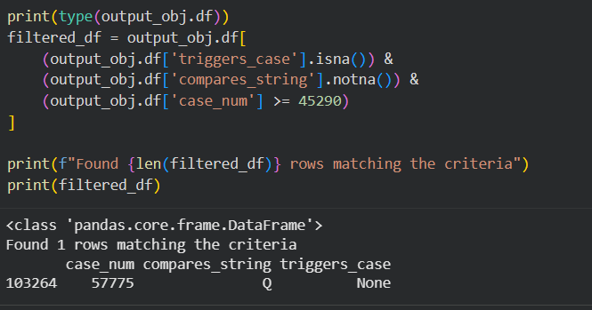

Here it is! case number `57775` is the winning case. 

Now we must find how to reach it.
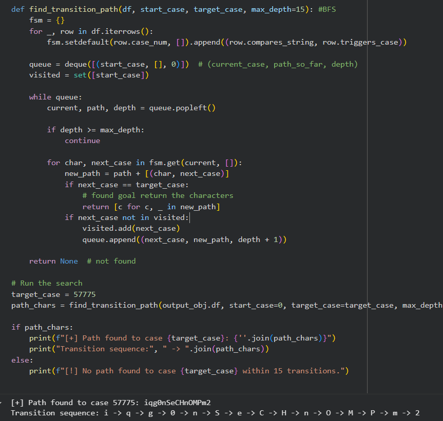
These 15 characters with the last character as "`Q`" (in `case 57775`) makes the entire 16 character password which reveals the flag:
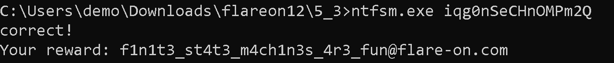

If you literally got this far, a genuine thanks to you.

As a bonus i was crazy enough to try to visualize this using some python libraries and the following graph (of around 100 cases only). It just looks like straight out of a cool hacker movie, that's why i wanted it to be here. 

Anyways Adios!
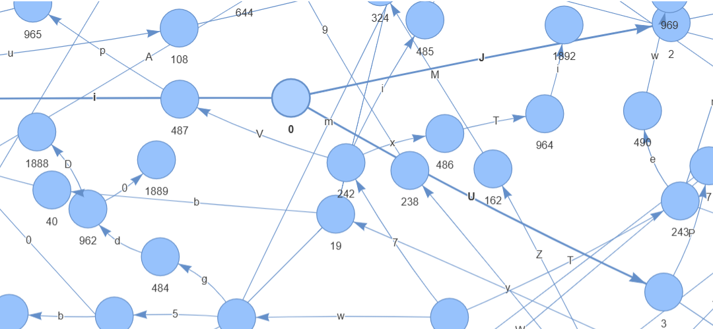
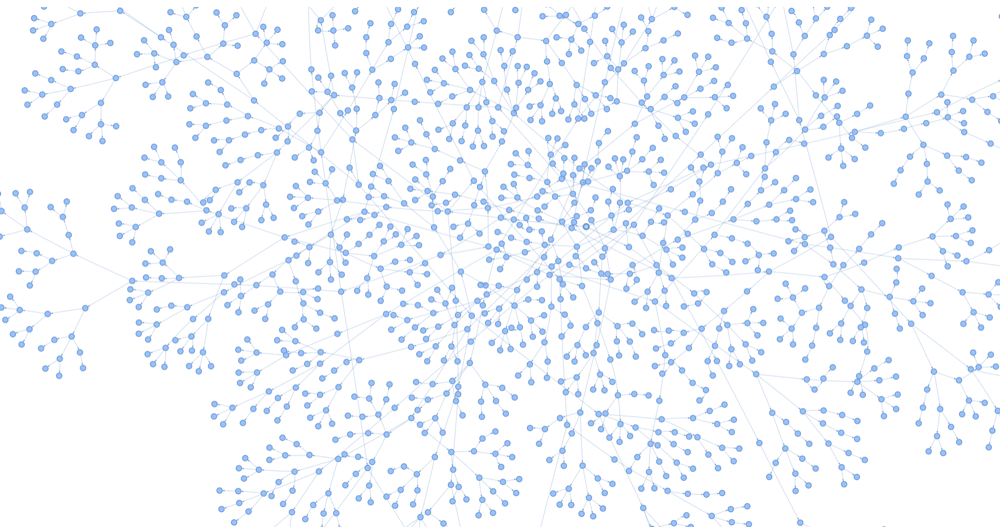